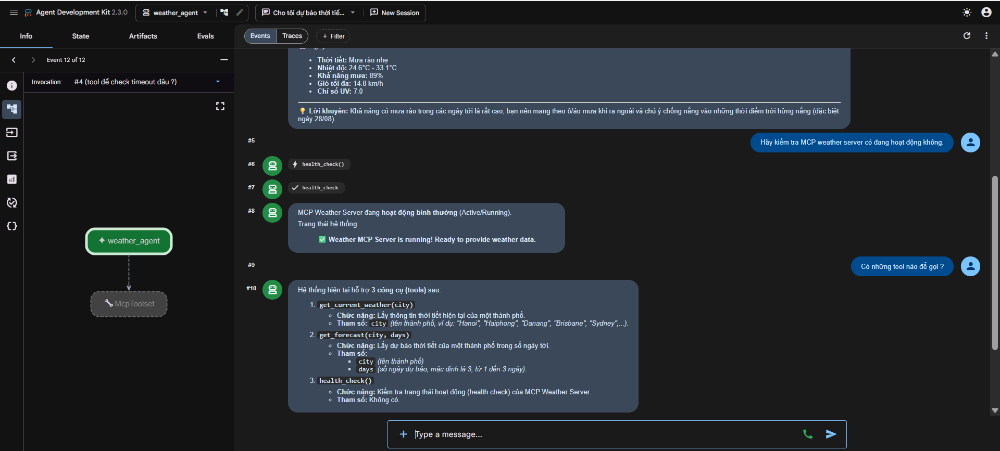
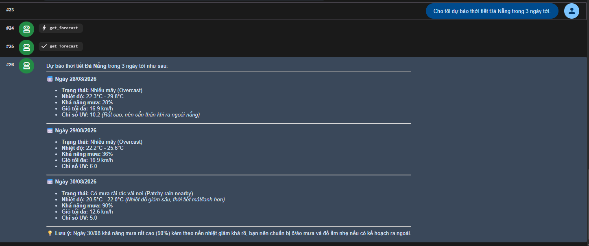
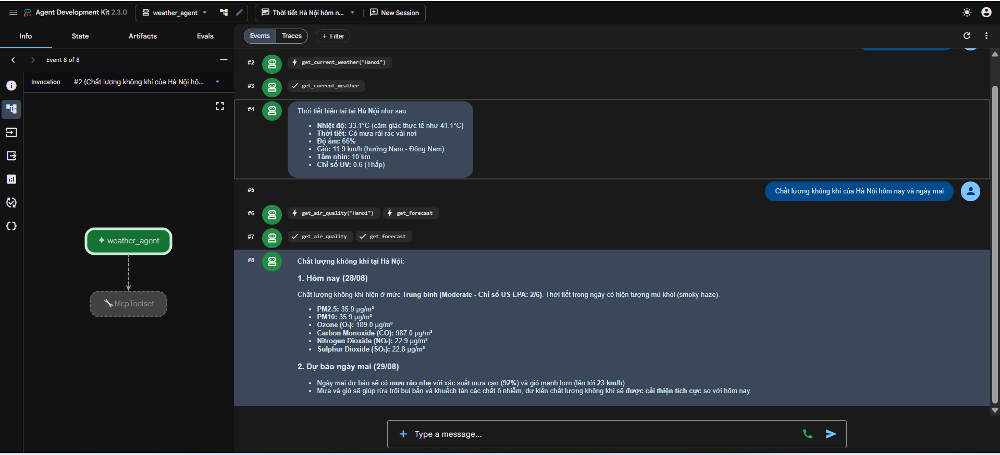

# Lab 04 — Weather Agent with Remote MCP Server

A weather agent built with Google ADK that connects to an MCP server via Streamable HTTP transport.

## Architecture

```
┌─────────────────┐   Streamable HTTP    ┌─────────────────┐      REST       ┌─────────────────┐
│   ADK Agent     │ ──────────────────── │   MCP Server    │ ─────────────── │  WeatherAPI.com │
│  (mcp-client)   │   localhost:8085/mcp │  (mcp-server)   │                 │                 │
└─────────────────┘                      └─────────────────┘                 └─────────────────┘
```

## Tools

| Tool | Description |
|------|-------------|
| `get_current_weather(city)` | Get current weather conditions for a city |
| `get_forecast(city, days)` | Get weather forecast (1–3 days) |
| `get_air_quality(city)` | Get current EPA category and pollutant concentrations |
| `health_check()` | Verify server is running |

## ADK làm gì trong Lab này?

ADK (Agent Development Kit) đóng vai trò **MCP Client** 
```
┌─────────────────────────────────────────────────────────────────┐
│                                                                 │
│  1. KẾT NỐI tới MCP Server qua Streamable HTTP                  │
│     StreamableHTTPConnectionParams(url="localhost:8085/mcp")    │
│                                                                 │
│  2. KHÁM PHÁ tools tự động (list_tools)                         │
│     McpToolset → tự hỏi server "anh có tool gì?"                │
│     → nhận weather, forecast, air quality và health tools      │
│                                                                 │
│  3. TRUYỀN tools cho LLM (Gemini)                               │
│     Agent(model="gemini-3.6-flash", tools=[weather_tools])      │
│     → Gemini biết nó có thể gọi 4 tools trên                    │
│                                                                 │
│  4. ĐIỀU PHỐI vòng lặp Function Calling                         │
│     User hỏi → Gemini chọn tool → ADK gọi MCP Server            │
│     → nhận kết quả → đưa lại cho Gemini tổng hợp                │
│                                                                 │
│  5. CUNG CẤP giao diện web (adk web)                            │
│     → http://localhost:8000 để chat với agent                   │
│                                                                 │
└─────────────────────────────────────────────────────────────────┘
```

So với bài 02 (viết client thủ công bằng `mcp.ClientSession`), ADK giúp bạn **không phải viết vòng lặp function calling thủ công** nữa. Toàn bộ luồng list_tools → model quyết định → call_tool → model tổng hợp được ADK xử lý tự động.

## Setup

### 1. MCP Server

```powershell
cd mcp-server
python -m uv sync

# Set your WeatherAPI key (get one free at https://weatherapi.com)
$env:WEATHERAPI_KEY = "your_weatherapi_key"

# Start the server (runs on port 8085 by default)
python -m uv run python weather.py
```

The server will be available at `http://localhost:8085/mcp`.

### 2. ADK Agent (Client)

```powershell
cd mcp-client
python -m uv sync

# Set Gemini API key in this terminal
$env:GOOGLE_API_KEY = "your_gemini_api_key"

# Start ADK web interface
python -m uv run adk web
```

Open http://localhost:8000 in your browser, select `weather_agent`, and ask about the weather.

## Configuration

| Variable | Where | Description |
|----------|-------|-------------|
| `WEATHERAPI_KEY` | mcp-server | API key from weatherapi.com |
| `GOOGLE_API_KEY` | mcp-client process environment | Gemini API key |
| `PORT` | mcp-server (env) | Override server port (default: 8085) |

## Evidence

ADK Agent kết nối MCP Server và gọi `health_check()` thành công. Ảnh được chụp
trước khi bổ sung tool chất lượng không khí:



Gemini tự chọn `get_forecast` và trả dự báo thật ba ngày từ WeatherAPI:



Gemini tự hiểu câu hỏi tự nhiên, gọi đồng thời `get_air_quality("Hanoi")` và
`get_forecast`, sau đó tổng hợp dữ liệu chất lượng không khí hiện tại cùng dự
báo thời tiết ngày mai:


