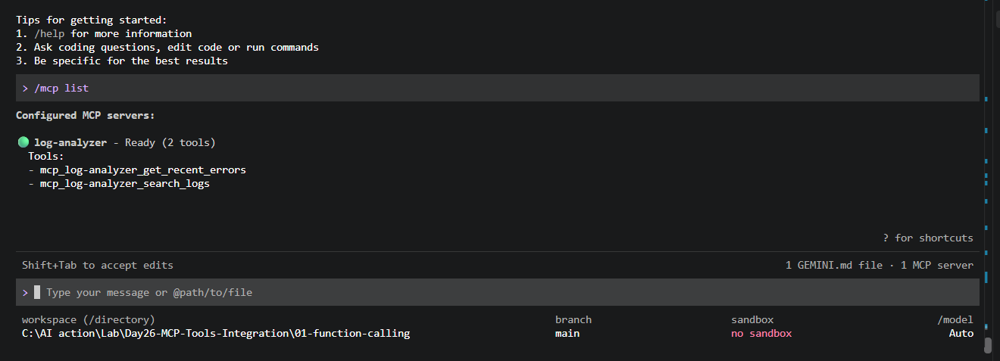
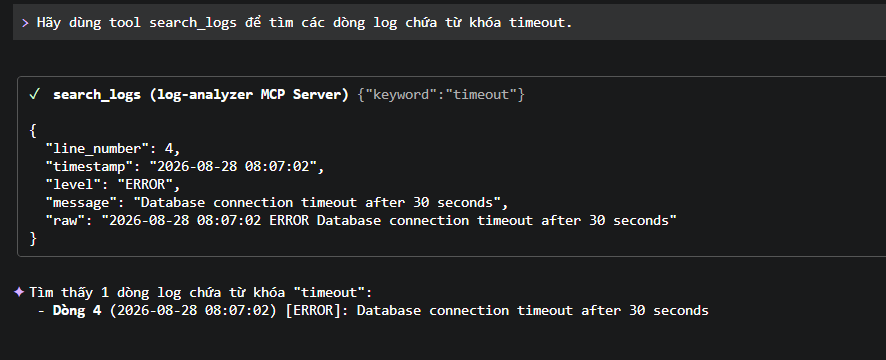

# Log Analyzer MCP Server

**Học viên:** Đinh Hoàng Quân<br>
**MSHV:** 2A202602034

Bài làm cá nhân Day 26: MCP Server tự động hóa việc đọc và phân tích file log.
Server có bản local qua `stdio`, bản production qua Streamable HTTP có Bearer
authentication, và versioning giữ tương thích với client cũ.

## Use case thực tế

**Công việc hiện tại:** đọc log để tìm lỗi và sự kiện bất thường của ứng dụng.

**Cách làm thủ công trước đây:** mở file log bằng trình soạn thảo, tìm các từ khóa
như `ERROR`, `CRITICAL`, `WARNING` hoặc `timeout`, rồi đọc từng dòng để xác định
sự cố mới nhất.

**Input:** từ khóa cần tìm, số kết quả tối đa và level log tùy chọn ở phiên bản v2.

**Output:** danh sách log khớp điều kiện, gồm số dòng, thời gian, level và nội dung.

Tool đọc dữ liệu trực tiếp từ `data/app.log`; kết quả không được hard-code trong
hàm. File mẫu có thể được thay bằng log thật cùng định dạng mà không phải sửa tool.
Server chỉ đọc file nằm trong thư mục dữ liệu được quản lý, không nhận đường dẫn
tùy ý từ client.

## Cấu trúc

```text
log-analyzer/
├── data/app.log              # Dữ liệu log
├── server.py                 # Bài Dễ: MCP stdio
├── test_client.py            # MCP client kiểm thử local
├── production_server.py      # Bài Trung bình + Khó
├── check_auth.py             # Test token sai/thiếu
├── legacy_client.py          # Client cũ gọi v1
├── production_client.py      # Client mới đọc metadata, chọn v2
├── requirements.txt
└── docs/
    ├── screenshots/          # Bằng chứng chạy
    └── test-results.md       # Kết quả kiểm thử
```

## Tools và input/output

### `search_logs(keyword, limit=50)` — v1

Tìm các dòng chứa `keyword`, không phân biệt chữ hoa/chữ thường.

| Input | Kiểu | Bắt buộc | Mô tả |
|---|---|---|---|
| `keyword` | `str` | Có | Từ khóa, ví dụ `timeout` hoặc `ERROR` |
| `limit` | `int` | Không | Số kết quả tối đa, mặc định 50, phạm vi 1–200 |

Output là danh sách kết quả. Mỗi phần tử có:

| Field | Mô tả |
|---|---|
| `line_number` | Số dòng trong file log |
| `timestamp` | Thời điểm sự kiện |
| `level` | `INFO`, `WARNING`, `ERROR` hoặc `CRITICAL` |
| `message` | Nội dung sự kiện |
| `raw` | Dòng log nguyên bản |

Input mẫu:

```json
{"keyword": "timeout", "limit": 20}
```

### `get_recent_errors(limit=10)`

Lấy các dòng `ERROR` hoặc `CRITICAL` gần nhất, sắp xếp mới nhất trước.

| Input | Kiểu | Bắt buộc | Mô tả |
|---|---|---|---|
| `limit` | `int` | Không | Số lỗi cần lấy, mặc định 10, phạm vi 1–200 |

Output dùng cùng cấu trúc một dòng log như `search_logs`.

### `search_logs_v2(keyword, limit=50, level="")` — v2

Giữ khả năng tìm kiếm của v1, bổ sung lọc level và metadata có cấu trúc.

| Input | Kiểu | Bắt buộc | Mô tả |
|---|---|---|---|
| `keyword` | `str` | Có | Từ khóa cần tìm |
| `limit` | `int` | Không | Số kết quả tối đa, phạm vi 1–200 |
| `level` | `str` | Không | `INFO`, `WARNING`, `ERROR` hoặc `CRITICAL` |

Output v2:

```json
{
  "api_version": "2.0",
  "query": {"keyword": "ERROR", "level": "ERROR", "limit": 10},
  "total_matches": 3,
  "results": []
}
```

## Bài Dễ — chạy local qua stdio

Từ thư mục gốc repository:

```powershell
python -m pip install -r .\04-lab\log-analyzer\requirements.txt
cd .\04-lab\log-analyzer
python test_client.py
```

`test_client.py` tự khởi động `server.py`, gọi `list_tools()` rồi kiểm thử hai
tools qua giao thức MCP. Nếu chạy riêng `python server.py`, server sẽ chờ MCP
Client qua `stdio`; không có output là bình thường.

## Đăng ký với Gemini CLI

Bài này sử dụng **Gemini CLI làm MCP Client**. Cài Gemini CLI trước, sau đó chạy
từ PowerShell ở thư mục gốc repository:

```powershell
$repoRoot = (Resolve-Path ".").Path
gemini mcp add log-analyzer `
  "$repoRoot\.venv\Scripts\python.exe" `
  "$repoRoot\04-lab\log-analyzer\server.py"
```

Mở Gemini CLI và kiểm tra:

```text
/mcp list
```

Server phải ở trạng thái `Ready (2 tools)`. Kiểm thử bằng yêu cầu tự nhiên, không
nêu trước tên tool:

```text
Trong log có sự cố timeout nào không?
```

```text
Tìm và tóm tắt 5 lỗi gần nhất trong log.
```

Mục tiêu là để Gemini tự khám phá schema, chọn tool và sinh arguments phù hợp.

## Bài Trung bình — Streamable HTTP và Authentication

`production_server.py` chạy tại `http://127.0.0.1:8086/mcp` và yêu cầu Bearer
token. Token bắt buộc lấy từ biến môi trường, không có giá trị bí mật mặc định.

Terminal 1 — chạy server:

```powershell
cd .\04-lab\log-analyzer
$env:LOG_MCP_TOKEN = "thay-bang-token-rieng-cua-ban"
python production_server.py
```

Terminal 2 — test token đúng bằng client cũ:

```powershell
cd .\04-lab\log-analyzer
$env:LOG_MCP_TOKEN = "thay-bang-token-rieng-cua-ban"
python legacy_client.py
```

Kết quả mong đợi: client khởi tạo MCP session và gọi `search_logs` thành công.

Test token sai và không có token:

```powershell
python check_auth.py
```

Kết quả mong đợi:

```text
Token sai: HTTP 401
Không có token: HTTP 401
```

Để thử trong LAN, chạy server với `LOG_MCP_HOST=0.0.0.0`, mở cổng 8086 trong
firewall và đặt `LOG_MCP_URL=http://<LAN-IP>:8086/mcp` trên client. Không mở cổng
ra Internet khi chưa có HTTPS, quản lý token và rate limiting phù hợp.

## Bài Khó — Versioning và backward compatibility

Production server giữ song song:

- `search_logs` v1 để client cũ không bị hỏng.
- `search_logs_v2` trả format mới và hỗ trợ lọc theo level.
- `server://info` công bố server version, tool versions, capabilities, deprecated
  tools, replacement và migration guide.

Client cũ:

```powershell
python legacy_client.py
```

Client mới đọc metadata trước khi chọn tool:

```powershell
python production_client.py
```

Luồng client mới:

```text
read_resource("server://info")
→ list_tools()
→ có search_logs_v2: chọn v2
→ không có v2: fallback search_logs v1
```

## Biến môi trường

| Biến | Mặc định | Mục đích |
|---|---|---|
| `LOG_MCP_TOKEN` | Không có | Bearer token bắt buộc cho production server/client |
| `LOG_MCP_HOST` | `127.0.0.1` | Địa chỉ server lắng nghe |
| `LOG_MCP_PORT` | `8086` | Cổng server |
| `LOG_MCP_URL` | `http://127.0.0.1:8086/mcp` | URL client kết nối |

## Bằng chứng chạy

Gemini CLI nhận MCP Server và khám phá hai tools:



Gemini tự gọi tool và trả đúng dòng log chứa `timeout`:



Kết quả Auth và Versioning dạng text nằm tại
[`docs/test-results.md`](docs/test-results.md).

Ba ảnh ADK Weather Agent ở `docs/screenshots/03-*`, `04-*` và `05-*` là bằng
chứng bổ sung cho Lab 04, không phải bằng chứng chính của bài Log Analyzer.
Ảnh `05-adk-air-quality-hanoi.png` chứng minh Gemini tự gọi tool
`get_air_quality` từ câu hỏi tự nhiên và kết hợp kết quả với `get_forecast`.

## Bảo mật trước khi commit

- Không commit `.env`, API key, access token, password, private key hoặc secret.
- Dùng biến môi trường cho credential.
- Chạy `git status` và rà staged diff trước khi commit.
- File `.gitignore` ở root đã loại `.env`, virtual environments, ADK runtime và
  cấu hình `.gemini/` mang đường dẫn cá nhân.
